```{r setup, include=FALSE}
knitr::opts_chunk$set(echo = FALSE)
library(kableExtra)
library(dplyr)
library(metaforest)
options("kableExtra.html.bsTable" = T)
```

<!--
Siddaway, A. P., Wood, A. M., & Hedges, L. V. (2019). How to do a systematic review: a best practice guide for conducting and reporting narrative reviews, meta-analyses, and meta-syntheses. Annual review of psychology, 70, 747-770.-->

<!-- Janneke Staaks - Systematic Review Search Support https://osf.io/49t8x/-->


<!--# Meta-analysis using R

Reading data,
Running the analysis
Forest plot
Exporting results
-->


<!--mistakes in the selection of a statistical model, and mistakes
in interpreting the mean effect and its confidence interval.-->

# Meta-Analysis

## Intro

I'm going climbing with two groups of friends

One person from each group tells me the average level of their group (French grade)

I will book a guide for the average level of all friends

$$
\begin{aligned}
 X_1:& [4, 4, 6, 7, 5] &M_1 &= 5.2 \\
 X_2:& [6, 7] &M_2 &= 6.5 \\
\end{aligned}
$$
What is the overall mean?

$\frac{5.2+6.5}{2} = 5.85$ VS $\frac{5.2}{5} + \frac{6.5}{2} = 4.29$

Meta-analysis similarly calculates a weighted mean of the effect sizes.

## Definition

Statistical procedures for synthesizing results of previous research to arrive at conclusions about the body of research.

* Quantitative: numbers
* Systematic: methodical
* Combining: putting together
* Previous research: whats already done
* Conclusions: new knowledge

## Evidence pyramid

```{r, out.width = "100%"}
 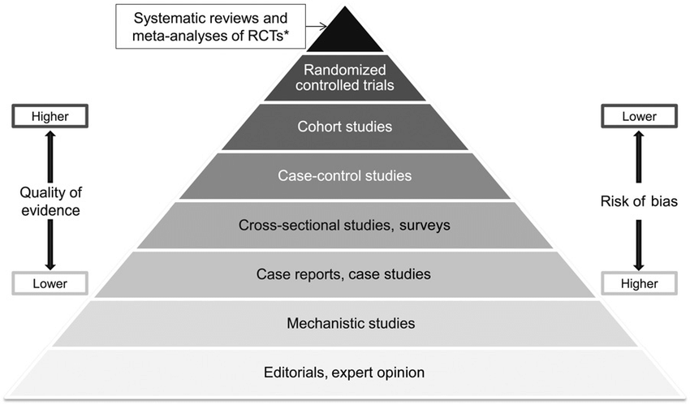
```


## Cases and variables

In primary research:

* Cases: Individual participants 
* Variables: Characteristics / individual differences

In meta-analysis:

* Cases: Studies, or effect sizes
* Variables: Between-study differences, or 'moderators'

## History: Pearson

Karl Pearson (1904)

* Studies on efficacy of typhoid vaccination
* *"Many of the groups… are far too small to allow of any definite opinion being formed at all, having regard to the size of the probable error involved."*

## History: Glass

Eysenk concluded psychotherapy does not work

* No consensus: 25 years of evaluation research, hundreds of studies

1978: Gene V. Glass aggregates findings of 375 intervention studies

* Glass introduces term "meta-analysis"

## History: Progression

Shift from narrative reviews to systematic reviews:

* < 1990s: Narrative review: study, critique, and summarize literature
* Early 1990s: Rise of meta-analysis
* Now: Considered gold standard of evidence


## Distinct from lit review

```{r tablelitrev}
tab <- data.frame("Traditional Review" = c("Individual", "Unguided/motivated", "Author's judgment"),
                  "Systematic Review" = c("Team", "Protocol", "Qualitative"),
                  "Meta-analysis" = c("Team", "Protocol", "Statistical"),
                  row.names = c("Author", "Search", "Conclusion"),
                  check.names = FALSE)
kable(tab) %>%
  kable_styling(bootstrap_options = c("striped", "hover"))
```

## Popularity

```{r, out.height = "100%"}
 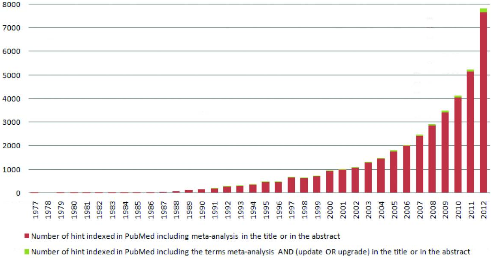
```

## Popularity

Popularity of this method has grown tremendously [@ioannidisMassProductionRedundant2016]

Considered "gold standard" of scientific evidence [@crocettiSystematicReviewsMetaAnalysis2016]

Why?

1. Output of primary research keeps increasing [@bornmannGrowthRatesModern2015]
2. "Replication crisis" increased demand for reliable findings
3. Incentives:
    * Limited effort and cost
    * Highly cited and respected
    

## Goals of meta-analysis

1. Summarize effect
2. Increase statistical power and precision
3. Develop, refine and test hypothesis
4. Reduce the subjectivity of study comparisons by using systematic and explicit comparison procedure
5. Identify data gap in the knowledge base and suggest direction for future research
6. Power analysis for future studies
7. Identify heterogeneity
8. Account for heterogeneity


## Steps in meta-analysis

1. Define research question and hypotheses
2. Define the criteria for including and excluding studies
3. Conduct search
4. Determine eligibility
5. Code effect size and moderators
6. Select or translate results from each study using a common metric
7. Estimate overall effect size
8. Evaluate homogeneity
9. Explore homogeneity
9. Sensitivity analyses

<!--to assess the impact of excluding or down-weighting unpublished studies, studies of lower quality, out-of-date studies, etc.-->


# Effect sizes

## What effect sizes?

The effect size (or treatment effect) is the unit of analysis in a meta-analysis. 

* "Descriptive" statistics (mean, SD, p, Cronbach's alpha)
* Differences between groups
    - Mean difference (between groups, repeated measures)
    - Difference in over-time change between groups
    - Risk ratio
* Association
    - Correlation
    - Regression coefficient
* Etc

## Effect sizes: What do you need?

* Study must report the required effect size
* Otherwise it must report sufficient statistics to compute it
* You can convert from some effect sizes to others

Resources for converting:

* [Campbell collaboration PDF](https://campbellcollaboration.org/media/k2/attachments/converting_between_effect_sizes.pdf)
* [Daniel Lakens' spreadsheet](https://osf.io/vbdah/)

## Effect sizes: Pitfals

* Control variables
* Dependency in the data (e.g., repeated measures)

# Averaging studies

## How to combine?

Starting with the summary statistic for each study, how should we combine these??

A simple average gives each study equal weight

This seems intuitively wrong

All studies are created equal.. but some are more equal than others

## Weighting studies

More weight for more informative studies

* More participants
* Lower variance

This is reflected in the sampling variance (standard error)

## Effect sizes: Standard error

Standard error affects the weighting in meta-analysis

Also referred to as **sampling variance** 

* SE is the SD of the sampling distribution
* $SE^2$ is the variance of the sampling distribution
* It is a measure of precision / uncertainty about the sample statistic as an estimator of the population value
* Small SE: Accurate estimate
* Big SE: Uncertain estimate

E.g., SE of the mean:

$$SE_\mu = \frac{SD}{\sqrt{n}}$$

## Effect sizes: Sampling distribution

<iframe src="https://rpsychologist.com/d3/CI/"></iframe>

## Effect sizes: Sampling distribution

<iframe src="https://utrecht-university.shinyapps.io/cjvanlissa_sampling_distribution/"></iframe>

## Weighting studies: Inverse-variance

Inverse-variance method: 
 
 $$
 W_i = \frac{1}{v_i} = \frac{1}{SE^2_i}
 $$

More precise study: Bigger weight

## Effect sizes: Finding the SE

Standard error is usually based on:

* Relevant measures of variability (more variable --> bigger SE)
* Sample size (bigger sample --> smaller SE)

SE is almost always reported for

* E.g., regression coefficients

For other statistics, SE is almost never reported:

* Correlation
* Cronbach's alpha

**Familiarize yourself with the formula for the SE of your effect size BEFORE you collect data!**

# Calculating weighted average

## Fixed effect model

Assumes that true effect is the same in each study (fixed) (Hedges, 1998)

Differences between studies due to random (sampling) error

This assumption probably (?) holds for:

* Replication studies
* Multiple studies within one paper

## Fixed effect: Formulas

For a collection of $k$ studies, the observed effect size $y_i$ of each individual study $i$ (for $i = 1, 2, \dots k$) is given by:

$$
\begin{aligned}
y_i &= \theta + \epsilon_i &\text{where } \epsilon_i \sim N(0, \sigma^2_i)
\end{aligned}
$$

## Fixed effect: pooling

Inverse-variance weights

Variance is the $SE^2$

$$ W_i = \frac{1}{v_i}$$

Summary effect:

$$\hat{\theta} = \frac{\sum_{i=1}^{k}(W_i*y_i)}{\sum_{i=1}^{k}W_i}$$

 
# Is there one TRUE effect?

What is heterogeneity?

How to deal with heterogeneity?

Interpreting heterogeneity indices

## Heterogeneity

Fixed effect assumption appropriate for (close) replication studies

But what if studies are a bit more heterogenous?

What if they are a LOT more heterogenous?

## Heterogeneity

Common application of meta-analysis:

* Summarizing heterogenous body of literature

Differences between studies with respect to:

* Patients: diagnosis, in- and exclusion criteria, etc.
* Interventions: type, dose, duration, etc.
* Outcomes: type, scale, cut-off points, duration of follow-up, etc.
* Quality and methodology: randomised or not, allocation concealment, blinding, etc.


## How to deal with heterogeneity

1. Do not pool at all (apples / oranges)
2. Ignore heterogeneity: use fixed effect model
3. Allow for heterogeneity: use random effects model
4. Explore heterogeneity
    - Subgroup analysis
    - Meta-regression
    - MetaForest


## Random effects model

True effect follows a distribution

Differences between observed effect sizes arise from two sources of variance: 

* Sampling error
* Normal distribution of true effect sizes
    - Between-studies heterogeneity
    - Variance of the distribution
    
Assumption holds:

* When there are no systematic differences between studies

## Random effects: Formulas

The random-effects model is thus given by:

$$
\begin{aligned}
y_i &= \theta_i + \epsilon_i &\text{where } \epsilon_i &\sim N(0, \sigma^2_i)\\
\theta_i &= \mu + \zeta_i &\text{where } \zeta_i &\sim N(0, \tau^2)
\end{aligned}
$$

Results in wider confidence intervals (conservative)

Studies are **un-weighted** when between-studies heterogeneity is large

## Random effects weights

Two sources of variance:

$$ W_i = \frac{1}{v_i+\tau^2}$$

Summary effect:

$$\hat{\theta} = \frac{\sum_{i=1}^{k}(W_i*y_i)}{\sum_{i=1}^{k}W_i}$$


## Heterogeneity statistics: tau2

$\tau^2$ is the (estimated) variance of the distribution of true effect sizes

It is expressed in the same units as the within-studies variance

## Heterogeneity statistics: Q

Q is a weighted sum of squared deviations of observed effect sizes around the pooled effect size

* Test of Q has poor power
* People sometimes use $\alpha = .10$
    - But: Few studies - usually not significant
    - Many studies - essentially always heterogeneity
    - So, not very useful

$Q = \sum_{i=1}^{k}W_i*(y_i-\hat{\theta})^2$

## Heterogeneity statistics: I2

$I^2$ describes the percentage of variation across studies that is due to heterogeneity rather than chance (Higgins and Thompson, 2002; Higgins et al., 2003). 

* Are individual effects further away from pooled effect, beyond what is expected by chance?


$$I^2 = 100\% * \frac{Q-df}{Q}$$

Intuitive and simple expression of the inconsistency of studies’ results

Unlike Q it does not inherently depend upon the number of studies considered (standardized)

## Heterogeneity

Low heterogeneity: 

* Effect is robust
* Estimate true effect size with better precision than we could with a single study

High heterogeneity:

* Quantify the variation
* Explore / explain it


## Pitfalls

Some people test for heterogeneity, and if that test is not-significant, they use a fixed-effect model

* Better to make this decision on **theoretical** grounds

# Reporting practices

## Forest plot

Graphical display of results from individual studies on a common scale

Each study represented by black square and a horizontal line (CI:95%)

Area of black square reflects study weight

## Forest plot

```{r, echo = FALSE, out.width="80%"}
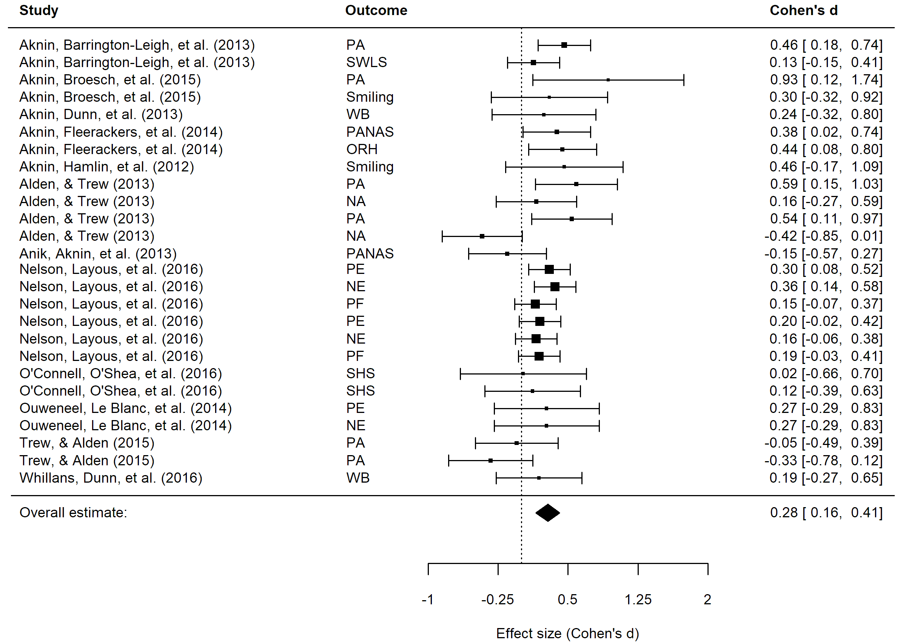
```


## Confidence intervals

Point estimate is the best guess of the effect

Confidence interval expresses our uncertainty about this guess


95% CI: 

* Range of values we expect to include the true effect
* The "probability" is in the procedure!
* If we repeat this procedure 100 times, 95 of CIs will contain the true effect

## Significance

Significance

* p-value from Z (or t-) test based on estimate and SE
* CI excludes zero
* But: Large (combined) samples, often significant

Relevance

* What effect size is clinically important/theoretically meaningful?


# Moderators

We're not done with heterogeneity

How common is it that there are no systematic differences between studies?

## Causes for heterogeneity

Comparing the effect size in different groups of studies

* Several scales used in your field
* Competing experimental paradigms
* Experimental VS correlational research
* Standard dose VS high dose
* Experimental manipulation VS multi-week intervention

You can **code** all these differences as **moderator variables**

Control for them in the analysis

## Moderators: Multi-group

Similar to a t-test / ANOVA:

$$y_i = \hat{\mu}_1D_{1i} + \hat{\mu}_2D_{2i} + \epsilon_i$$

In meta-analysis:

$$\theta_i = \hat{\gamma}_1D_{1i} + \hat{\gamma}_2D_{2i} + \zeta_i + \epsilon_i$$

Where $D$ are dummy variables. 

Assumption: Homoscedasticity of heterogeneity

## Moderators: Meta-regression

Continuous moderators: Meta-regression

$$\theta_i = \beta_0 + \beta_1X_{1i} + \dots + \beta_pX_{pi} + \zeta_i + \epsilon_i$$

Really the same as normal regression analysis, but with an extra "error" term for the heterogeneity:

$$y_i = \beta_0 + \beta_1X_{1i} + \dots + \beta_pX_{pi} + \epsilon_i$$

## Moderators: Dummies in meta-regression

The effect of a grouping-variable can be expressed two ways.

By estimating both group means, using two dummies and no intercept:

$$\theta_i = \hat{\gamma}_1D_{1i} + \hat{\gamma}_2D_{2i} + \zeta_i + \epsilon_i$$

By estimating one intercept, reflecting the mean value of group one, and a dummy, reflecting the difference between group one and two:

$$\theta_i = \beta_0 + \beta_1D_{1i} + \zeta_i + \epsilon_i$$

Mathematically, they are identical. We can call the first one "ANOVA specification", and the second one "regression specification"

## Moderators: Remaining issues

* Often small sample < predictors
* Power issues
* Lack of theory to identify moderators
    - Moderator analysis is often exploratory
* Interactions? Non-linear effects?

We'll get to this later.

# Publication bias

## Publication bias

Assumption: Significant results are more likely to be published

* Well-supported by research

$\alpha = .05$: We accept 5% risk of false-positive findings (Type I error)

Worst case scenario: 

* Published literature is that 5%
* 95% of studies go into the "file drawer"

Including only published studies can introduce **publication bias**

## Publication bias: Detecting it

Funnel plots

* X = effect size
* Y = SE (as a measure of uncertainty)

## Publication bias: Funnel plot

```{r echo = TRUE, eval = FALSE}
# Load the Happy to Help? Data
data(curry)
# Random effects meta-analysis
model <- rma(d, vi, data = curry)
# Funnel plot
funnel(model, 
       back = "white", 
       level = c(90, 95, 99),
       shade = c("white", "gray", "darkgray"))
```

## Publication bias: Funnel plot

```{r message=FALSE}
#out.width = "800px", out.height= "400px", 

data(curry)
model <- rma(d, vi, data = curry)
funnel(model, 
       back = "white", 
       level = c(90, 95, 99),
       shade = c("white", "gray", "darkgray"))
```

## Publication bias: Funnel with bias


```{r message=FALSE}
#out.width = "800px", out.height= "400px", 
df_bias <- curry
# Identify the 20 effect sizes with the smallest effect sizes
small_effects <- order(df_bias$d)[1:20]
# Of these small effect sizes, find the ones with the biggest sampling variance
big_variance <- order(df_bias$vi[small_effects], decreasing = TRUE)
# Delete these studies:
delete_these <- small_effects[big_variance[1:10]]
df_bias <- df_bias[-delete_these, ]
m_bias <- rma(d, vi, data = df_bias)

# Carry out trim-and-fill analysis
m_taf <- trimfill(m_bias)
funnel(m_bias, 
       back = "white", 
       level = c(90, 95, 99),
       shade = c("white", "gray", "darkgray"))
```

## Publication bias: Detecting it

Egger test: Formal test of funnel asymmetry

* Predicting effect size from its standard error

Trim and fill method: 

* Small studies removed from funnel plot until it is symmetric
* Replace the small studies and balance them with studies on the opposite side of the funnel

## Publication bias: Trim and fill

```{r message=FALSE}

funnel(m_taf)
```

## Publication bias: File drawer

File drawer analysis (Rosenthal, 1979):  

How many studies, averaging null results, would have to be added to reduce the combined significance level (p-value) to non-significance?

## Publication bias: P-curve

Different assumption:

* Publication bias occurs because researchers p-hack their analyses (Head et al. 2015)
* New approach (Simonsohn, Simmons, and Nelson 2015)
* https://www.p-curve.com/
* **Still quite experimental**

```{r, echo = FALSE, out.width="65%"}
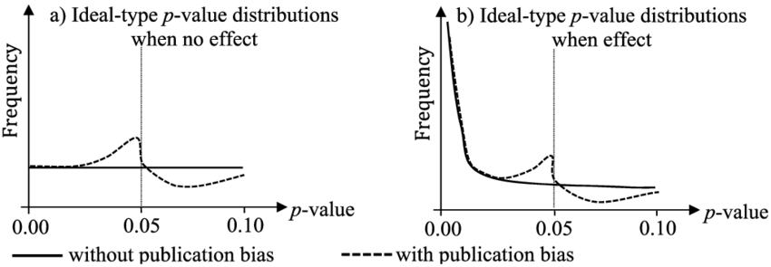
```

# Dependency in the data

## Dependent data: Multiple samples

* Effects for two or more independent subgroups
* Impact of a treatment for two (or more) independent samples

Options:

1. Treat the samples as independent "studies"; there is no problem with dependency
2. Merge the samples. E.g., males and females have been reported separately; all your other studies combine them
    - Use fixed-effect meta-analysis on the two (or more) subsamples

## Dependent data: Multiple outcomes

The same participants reported on 

* Multiple outcomes
* Multiple time points

Options:

1. Unweighted average of effect sizes **and** SEs within study
    - NOTE: You need the correlation between the different outcome variables
2. Three-level multilevel meta-analysis
3. Robust variance estimation

# Three-level meta-analysis

## Meta-analysis IS multilevel

```{r, echo = FALSE, out.width="100%"}
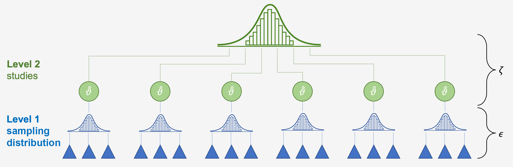
```

## Three-level meta-analysis

```{r, echo = FALSE, out.width="100%"}
knitr::include_graphics('materials/multilevel-model2.png')
```

## Three-level meta-analysis: Formulas

$$
      \left.
      \begin{aligned}
        y_{jk} &= \beta_{jk} + \epsilon_{jk} &\text{where } \epsilon_{jk} &\sim N(0, \sigma^2_{\epsilon_{jk}})\\
        \beta_{jk} &= \theta_k + w_{jk} &\text{where } w_{jk} &\sim N(0, \sigma^2_{w})\\
        \theta_{k} &= \delta + b_{k} &\text{where } b_k &\sim N(0, \sigma^2_{b})
      \end{aligned}
      \right\}
$$

## Three-level meta-analysis

Advantage

* Account for dependent data
* No need to know sampling **co**variance for every pair of outcomes
* Can include predictors at effect-size and between-study level

Assumption

* All sampling covariances are the same


# Sensitivity analysis

## Sensitivity analyses

So many statistical options

Show that results are not affected by these decisions

Informal comparisons, often in table

Examples:

* Modifying the inclusion criteria ?
* Including and excluding questionable studies ?
* Including and excluding unpublished studies ?
* Weighting the analysis by study quality ?
* Trying different ways to impute missing data ?
* Ad each study, one by one, to see the change (or adding to forest plot)

# Exploring heterogeneity

## Applied meta-analysis

* Often summarizing heterogenous body of literature
* Different labs, populations, methods, instruments, etc
* "Supersitions" that meta-analysis is immune to small sample problems, because each data point is based on many participants
* Often small N, but many moderators (p)

## How to deal with heterogeneity

1. Do not pool at all (apples / oranges)
2. Ignore heterogeneity: use fixed effect model
3. Allow for heterogeneity: use random effects model
4. Explore heterogeneity
    - Subgroup analysis
    - Meta-regression

Sometimes, none of these solutions work

## How to deal with heterogeneity 2

When the number of studies is small, meta-regression lacks power to test more than a few moderators

We often lack theory **about study-level moderators** select moderators a-priori (Thompson & Higgins, 2002)

Too many moderators --> overfitting

## Overfitting illustrated

<iframe src="https://cjvanlissa.shinyapps.io/Polynomials/"></iframe>

## Exploring heterogeneity

How can we weed out which study characteristics influence effect size?

**MetaForest**

# Tree-based methods

## How do trees work?

“Regression trees” to explore which combinations of study characteristics jointly predict effect size

* Dependent Variable is Effect Size
* Independent Variables are Study Characteristics (moderators)


```
Tree algorithm

1. Split the data on the moderator/value that leads to the most  
   homogenous post-split groups on the dependent variable
2. IF the number of cases in the post-split group is smaller than X, stop
    - Else, repeat steps for the post-split group
```

## Tree

```{r out.width = "70%"}
 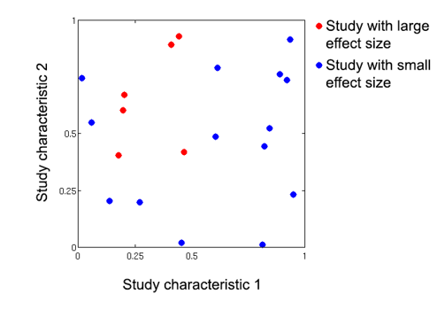
```

## Tree

```{r out.width = "70%"}
 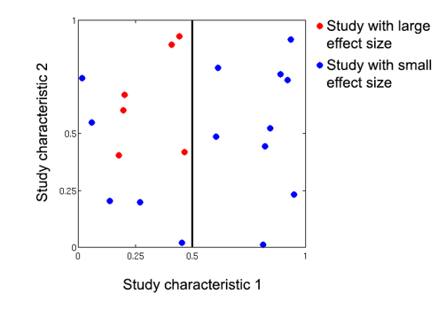
```

## Tree

```{r out.width = "70%"}
 
```

## Tree

```{r out.width = "70%"}
 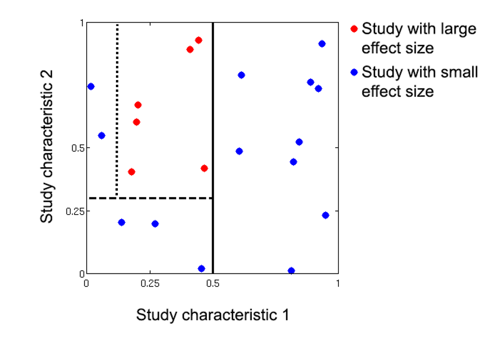
```

## Tree

```{r out.height = "100%"}
 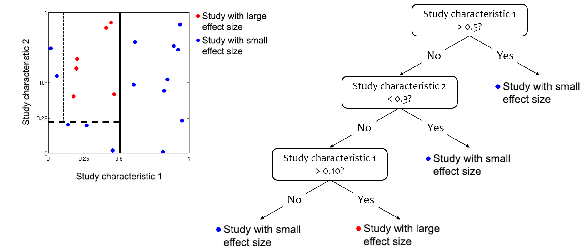
```


## Tree: Advantages

Trees easily handle situations where there are many predictors relative to observations

* Irrelevant predictors are simply ignored

Trees capture interactions and non-linear effects of moderators

* Represented as sequence of splits

Both these conditions are likely to be the case when performing meta-analysis in a heterogeneous body of literature

## Tree: Limitations

Single trees are very prone to overfitting

## Random forests: algorithm

```
Random Forests algorithm

1. Draw many (+/-1000) bootstrap samples
2. Grow a trees on each bootstrap sample
3. To make sure each tree learns something unique, 
   they are only allowed to choose the best moderator  
   from a small random selection of moderators at each split
4. Average the predictions of all these trees
```

## Random forests: Advantages

Random forests are robust to overfitting

* Each tree captures some “true” effects and some idiosyncratic noise
* Noise averages out across bootstrap samples

Random forests make better predictions than single trees

* Single trees predict a constant value for each “node”
* Forests average predictions of many trees, leading to smooth prediction curves

## MetaForest

Apply meta-analytic weights to random forests

Just like in classic meta-analysis, more precise studies are more influential in building the model

## MetaForest: Reporting

* Predictive $R^2$ for new data: $R^2_{oob}$ and $R^2_{cv}$
* Variable importance (which moderators most strongly predict effect size)
* Partial dependence plots

## MetaForest: Variable Importance

```{r, out.width = "90%"}
 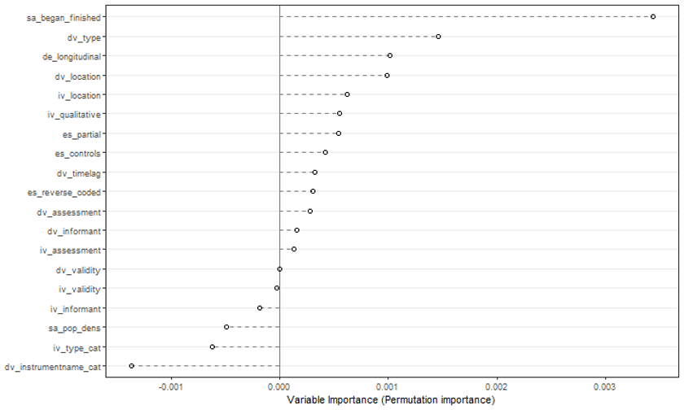
```

## MetaForest: Partial Dependence

```{r, out.width = "100%"}
 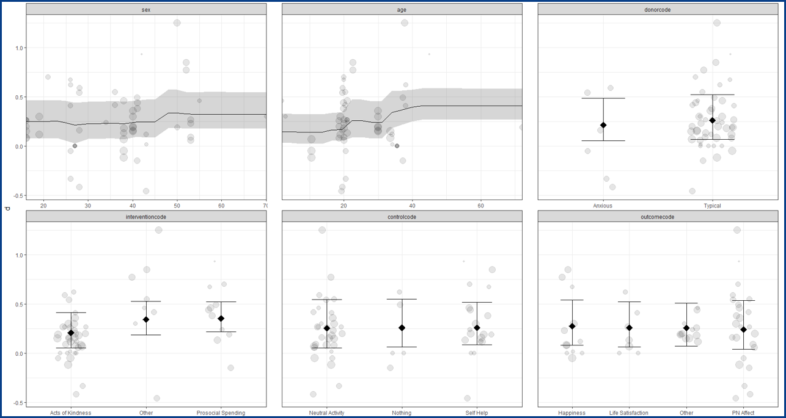
```

## MetaForest: Partial Dependence

```{r, out.width = "80%"}
 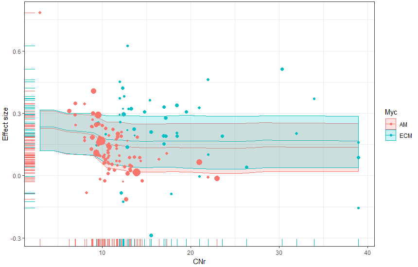
```

## MetaForest: Validation

Several simulation studies examining:

* Predictive performance
* Power
* Ability to identify relevant / irrelevant moderators
* Van Lissa, 2017: https://osf.io/khjgb/

## MetaForest: Results

MetaForest had sufficient power in most conditions, even for as little as 20 studies, 

* Except when the effect size was small (β = 0.2), and residual heterogeneity was high (τ2 = 0.28)

Power was most affected by true effect size and residual heterogeneity, followed by the true underlying model

## MetaForest: R package

R users: 

```
install.packages(“metaforest”)
??MetaForest
```

## MetaForest: Visual interface

<iframe src="https://cjvanlissa.shinyapps.io/MetaForest_online/"></iframe>


## MetaForest: Workflow

As final check:

1. Classic meta-analysis for summary effect
2. (Optional:) Test theoretical moderators
3. MetaForest as exploratory check for relevant moderators

As pre-screening:

1. MetaForest as exploratory check for relevant moderators
2. (Optional:) Test linear model of relevant moderators
3. Classic meta-analysis for summary effect

## MetaForest: Application 1

Happy to help? A systematic review and meta-analysis of the effects of performing acts of kindness on the well-being of the actor

* Journal of Experimental Social Psychology, 2018
* Used MetaForest to check for moderators
* Accepted WITHOUT QUESTIONS about this new technique
* Editor: “I see the final manuscript as having great potential to inform the field.”
* Open data and syntax at https://osf.io/sey6x/

Demo-data for this course

## MetaForest: Application 2

The behavioral phenotype of early life adversity: A 3-level meta-analysis of rodent studies.

* Neuroscience and Biobehavioral Reviews, 2019
* Bonapersona, Kentrop, Van Lissa, Van der Veen, Joëls, Sarabdjitsingh
* https://www.ncbi.nlm.nih.gov/pubmed/31047892
* Used MetaForest to pre-screen for moderators

## MetaForest: Application 3

The CO2 fertilization effect on global plant biomass

* César Terrer Moreno and colleagues
* Accepted in Nature Climate Change
* Used MetaForest for prediction:
    - Predicting the size of the CO$_2$ fertilization effect at every location around the world

## MetaForest: Application 4

Revisiting a meta-analysis of caregiver training studies: Using machine learning to identify moderators

* Van Lissa, Lont, & Fukkink, presented at SRCD DEVSEC 2018
* Open syntax, https://cjvanlissa.github.io/meta_caregivers/ 
* MetaForest as main analysis
* Examining maginal relationship of moderators with effect size
* Also used in in-press book chapter on small-sample meta-analyses (https://s4.wp.hum.uu.nl/book/)


## MetaForest: Applications


Owning leads to valuing: Meta-analysis of the Mere Ownership Effect

* Gao, Yao, & Feldman, preprint
* https://www.researchgate.net/publication/326462915_Owning_leads_to_valuing_Meta-analysis_of_the_Mere_Ownership_Effect
* Used MetaForest to identify relevant moderators
* Followed up with “classic” meta-regression (interpret with caution!)

Fathers' direct involvement and children's language outcomes: A meta-analysis and machine learning-based moderator analysis

* Van Lissa, Lucassen, & Keizer, presented EARA 2018
* Open data and syntax, web-presentation at https://osf.io/dz39y/ 

## Discussion questions

When does it make sense to perform a meta-analysis? 

How many studies do we need? 

How similar do the studies need to be? 

What is the role of a cumulative meta-analysis?

What if the meta-analysis appears to conflict with a large-scale study?

## Conflicting study

```{r, echo = FALSE, out.height="100%"}
knitr::include_graphics('materials/conflict_trial.png')
```


# Criticisms

## Criticisms of meta-analysis

* 1990 Charles Mann: future of meta-analysis
    - One person compared it to alchemy
    - Another compared it to terrorism
* 1993 New England Journal of Medicine:
    - Meta-analyses so likely to be flawed that it would be preferable to stick with narrative reviews
* 2016 Ioannides:
    - Mass Production of Redundant, Misleading, & Conflicted Meta-analyses
    - China mass-produces meta-analyses, including on abandones areas of research
    - Companies receive industry contracts to produce meta-analyses
    - Many published meta-analyses have serious flaws
    - Of the remaining, most have weak or insufficient evidence

## Criticisms: Literature selection

Meta-analysis reflects only whats published, searchable, or shared

Studies are **selected**, not randomly sampled from all possible studies

* Violates assumption of random-effects model

"Standing on the shoulders of giants"

* Researchers follow in each other's footsteps; this causes unknown dependency in the data


## Criticisms: Ecological falacy

We usually care about effects on individuals

Ecological fallacy:

* Can't make inferences about individuals from statistics about the group as a whole

Aggregation bias

* Pooled study-level effects might not reflect individual-level effects

## Criticisms: Repeated testing

* Trust only pre-planned analyses (ideally pre-registered)
* Testing effects suggested by data considerably increases risk of false-positive results
* Post hoc analysis should be deemed exploratory
* Correct the p-values for repeated testing (e.g., Bonferroni)


## Criticisms: Garbage

* Garbage in / garbage out
* Make sure to check quality of included studies
* Consider quality as moderator
* To see if small (bad?) studies have an undue effect, compare fixed-effect / random-effects estimates

# Further learning

## General preparation: Reporting

Familiarize yourself with reporting guidelines

[Preferred Reporting Items for Systematic Reviews and Meta-Analyses (PRISMA)](http://www.prisma-statement.org/) 

[PRISMA checklist](https://journals.plos.org/plosntds/article/file?type=supplementary&id=info:doi/10.1371/journal.pntd.0000381.s002)

[PRISMA explanation paper](https://journals.plos.org/plosmedicine/article?id=10.1371/journal.pmed.1000100)

## General preparation: Quality

[Quality of meta-analysis (AMSTAR)](http://www.bmj.com/content/bmj/358/bmj.j4008.full.pdf)

<font size="4">
1. Research questions / inclusion criteria use PICO (Pop, Intervention, Control, Outcome)<br>
2. A-priori protocol<br>
3. Explain selection of studies<br>
4. Comprehensive lit search<br>
5. De-duplication<br>
6. Data extraction in duplicate<br>
7. Justify excluded studies<br>
8. Adequate detail<br>
9. Assess RoB<br>
10. Report funding of primary studies<br>
11. Appropriate meta-analysis<br>
12. Sensitivity analysis for RoB<br>
13. Account for RoB<br>
14. Report / discuss heterogeneity<br>
15. Publication bias<br>
16. Conflict of interest
</font>

## Systematic reviews

Collaborate with a **librarian** if you have a good one!

Excellent materials by Janneke Staaks:

* Systematic Review Search Support https://osf.io/49t8x/

Siddaway, A. P., Wood, A. M., & Hedges, L. V. (2019). How to do a systematic review: a best practice guide for conducting and reporting narrative reviews, meta-analyses, and meta-syntheses. Annual review of psychology, 70, 747-770

## Systematic reviews: Zotero

```{r, echo = FALSE}

```

## Systematic reviews: Deduplication

<iframe src="https://sr-accelerator.com/#/help/dedupe"></iframe>


## Systematic reviews: Screening abstracts

```{r, echo = FALSE}

```

## Systematic reviews: Protocol

Need a clear protocol

Pre-register your meta-analysis!

* [Daniel Lakens](https://bmcpsychology.biomedcentral.com/articles/10.1186/s40359-016-0126-3)
* [Tutorial on OSF](http://help.osf.io/m/registrations/l/524205-register-your-project)

## Systematic reviews: Eligibility criteria

You can use these to eliminate studies, OR code them as moderators

## Systematic reviews: Bias in studies

Code methodological components as moderators

* Random assignment
* Blind assignment (blind everything)
* Dropout
* Power analysis/optional stopping

Use risk of bias assessments

* [ROBINS-I](https://www.bmj.com/content/355/bmj.i4919)

## Systematic reviews: Open science

Share your data when finished (https://osf.io)

```{r, echo = FALSE}
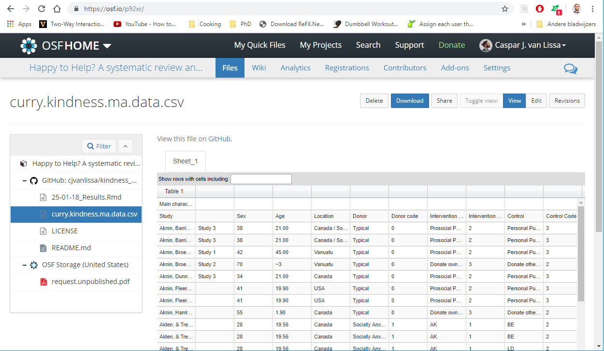
```

## metaSEM

Sometimes, research questions are about relationships between multiple variables

You can specify those as  SEM/path model

* Code a (partial) correlation matrix per study
* Code N for correlation matrix
* Pool correlation matrices using `library(metaSEM)`
* Estimate SEM-model on pooled correlation matrix
* Mike Cheung and Suzanne Jak

## metaSEM: Book

<!--iframe src="https://www.wiley.com/en-us/Meta+Analysis%3A+A+Structural+Equation+Modeling+Approach-p-9781119993438"></iframe>-->
  
[](https://www.wiley.com/en-us/Meta+Analysis%3A+A+Structural+Equation+Modeling+Approach-p-9781119993438)


## Continuously cumulating meta-analysis

Full data online, new studies can be added

## Continuously cumulating: Metalab

<iframe src="https://metalab.stanford.edu/app.html?id=visualization"></iframe>


## Automatic systematic reviews

Identifying relevant articles using machine learning

* https://github.com/msdslab/automated-systematic-review
* Only if you can program in Python

## This afternoon

Bring your laptop

Interactive tutorial using R / Rstudio

Manual online at https://cjvanlissa.github.io/Doing-Meta-Analysis-in-R/

Challenge: Repeat all the exercises in the manual, but use

```{r, echo = TRUE, eval = FALSE}
library(metaforest)
df <- fukkink_lont
```

Instead of

```{r, echo = TRUE, eval = FALSE}
df <- curry
```


## References