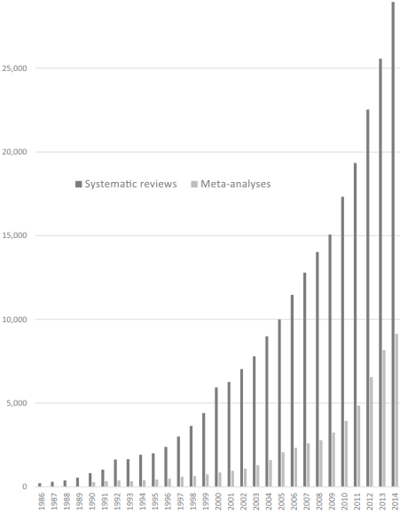

```{r setup, include=FALSE}
knitr::opts_chunk$set(echo = FALSE)
library(kableExtra)
library(dplyr)
library(metaforest)
options("kableExtra.html.bsTable" = T)
```

<!--
Siddaway, A. P., Wood, A. M., & Hedges, L. V. (2019). How to do a systematic review: a best practice guide for conducting and reporting narrative reviews, meta-analyses, and meta-syntheses. Annual review of psychology, 70, 747-770.-->

<!-- Janneke Staaks - Systematic Review Search Support https://osf.io/49t8x/-->


<!--# Meta-analysis using R

Reading data,
Running the analysis
Forest plot
Exporting results
-->


<!--mistakes in the selection of a statistical model, and mistakes
in interpreting the mean effect and its confidence interval.-->

# Meta-Analysis

## Definition

Statistical procedures for synthesizing results of previous research to arrive at conclusions about the body of research.

* Quantitative: numbers
* Systematic: methodical
* Combining: putting together
* Previous research: whats already done
* Conclusions: new knowledge

## Cases and variables

In primary research:

* Cases: Individual participants 
* Variables: Characteristics / individual differences

In meta-analysis:

* Cases: Studies, or effect sizes
* Variables: Between-study differences, or 'moderators'

## History: Pearson

Karl Pearson (1904)

Studies on efficacy of typhoid vaccination

"Many of the groups… are far too small to allow of any definite opinion being formed at all, having regard to the size of the probable error involved."

## History: Glass

Eysenk concluded psychotherapy does not work

25 years of evaluation research and hundreds of studies failed to resolve?
1978: Gene V. Glass aggregates findings of 375 intervention studies
Glass introduces term "meta-analysis"

## History: Progression

Shift from narrative reviews to systematic reviews:

* < 1990s: Narrative review: study, critique, and summarize literature
* Early 1990s: Rise of meta-analysis
* Now: Considered gold standard of evidence

## Popularity

```{r}
#  out.width = "800px", out.height= "400px"
 
```

## Popularity

Popularity of this method has grown tremendously [@ioannidisMassProductionRedundant2016]

Considered "gold standard" of scientific evidence [@crocettiSystematicReviewsMetaAnalysis2016]

Why?

1. Output of primary research keeps increasing [@bornmannGrowthRatesModern2015]
2. "Replication crisis" increased demand for reliable findings
3. Incentives:
    * Limited effort and cost
    * Highly cited and respected
    
## Distinct from lit review

```{r tablelitrev}
tab <- data.frame("Traditional Review" = c("Individual", "Unguided/motivated", "Author's judgment"),
                  "Systematic Review" = c("Team", "Protocol", "Qualitative"),
                  "Meta-analysis" = c("Team", "Protocol", "Statistical"),
                  row.names = c("Author", "Search", "Conclusion"),
                  check.names = FALSE)
kable(tab) %>%
  kable_styling(bootstrap_options = c("striped", "hover"))
```


## Goals

1. Summarize effect
2. Increase statistical power and precision
3. Develop, refine and test hypothesis
4. Reduce the subjectivity of study comparisons by using systematic and explicit comparison procedure
5. Identify data gap in the knowledge base and suggest direction for future research
6. Power analysis for future studies
7. Identify heterogeneity
8. Account for heterogeneity


## Technical intermezzo

Can we just calculate the average effect size?

Imagine I take two samples:

$$
\begin{aligned}
 X_1:& [2, 3, 2, 7, 5] &M_1 &= 3.8 \\
 X_2:& [6, 8] &M_2 &= 7 \\
\end{aligned}
$$
Back to basic statistics: What is the overall mean?

$\frac{3.8+7}{2}$ VS $\frac{3.8}{5} + \frac{7}{2}$

Meta-analysis similarly calculates a weighted mean of the effect sizes.

## Steps in meta-analysis

1. Define research question and hypotheses
2. Define the criteria for including and excluding studies
3. Conduct search
4. Determine eligibility
5. Code effect size and moderators
6. Select or translate results from each study using a common metric
7. Estimate overall effect size
8. Evaluate homogeneity
9. Explore homogeneity
9. Sensitivity analyses

<!--to assess the impact of excluding or down-weighting unpublished studies, studies of lower quality, out-of-date studies, etc.-->


# Effect sizes

## What effect sizes?

The effect size (or treatment effect) is the unit of analysis in a meta-analysis. 

* "Descriptive" statistics (mean, SD, p, Cronbach's alpha)
* Differences between groups
    - Mean difference (between groups, repeated measures)
    - Difference in over-time change between groups
    - Risk ratio
* Association
    - Correlation
    - Regression coefficient
* Etc

## Effect sizes: What do you need?

* Study must report the required effect size
* Otherwise it must report sufficient statistics to compute it
* You can convert from some effect sizes to others

Resources for converting:

* https://campbellcollaboration.org/media/k2/attachments/converting_between_effect_sizes.pdf
* https://osf.io/vbdah/

## Effect sizes: Pitfals

* Control variables
* Dependency in the data (e.g., repeated measures)

## Effect sizes: Standard error

<!--Compute an effect size for each study, and then use the meta-analysis to synthesize these values. -->

Standard error affects the weighting in meta-analysis

Also referred to as **sampling variance** 

* SE is the SD of the sampling distribution
* $SE^2$ is the variance of the sampling distribution

## Effect sizes: Standard error 2

Standard error is usually based on:

* Any relevant measures of variability (more variable --> bigger SE)
* Sample size (bigger sample --> smaller SE)

Sometimes, SE is almost always reported

* E.g., regression coefficients

For other statistics, SE is almost never reported:

* Correlation
* Cronbach's alpha

**Familiarize yourself with the formula for the SE of your effect size BEFORE you collect data!**

## Averaging studies?

Starting with the summary statistic for each study, how should we combine these??

A simple average gives each study equal weight

This seems intuitively wrong

Some studies are more likely to give an answer closer to the „true? effect than others

## Weighting studies

More weight to the studies which give us more information
 More participants
 More events
 Lower variance
 Calculated using the effect estimate and its variance
 
 Inverse-variance method: 
 
 $$
 W_i = \frac{1}{v_i}
 $$
 Pooled effect size:
 
 
 $$
 \hat{\theta} = \frac{\sum_{i=1}^{k}{w_i*y_i}}{\sum_{i=1}^{k}{w_i}}
 $$
 
## What is heterogeneity

Heterogeneity is variation between the studies? results

## Causes of heterogeneity

Differences between studies with respect to:

* Patients: diagnosis, in- and exclusion criteria, etc.
* Interventions: type, dose, duration, etc.
* Outcomes: type, scale, cut-off points, duration of follow-up, etc.
* Quality and methodology: randomised or not, allocation concealment, blinding, etc.


## Examining heterogeneity

Visually

* Forest plot: do confidence intervals of studies overlap with each other and the summary effect??

Statistically

* Chi-square test for heterogeneity
    - Mantel-Haenszel test
    - Cochran Q test
    
Tests whether the individual effects are farther away from the common effect, beyond what is expected by chance ?

Has poor power
P-value < 0.10 indicates significant heterogeneity

# Heterogeneity

What is heterogeneity?

How to deal with heterogeneity?

Interpreting heterogeneity indices


## How to deal with heterogeneity

1. Do not pool at all
2. Ignore heterogeneity: use fixed effect model
3. Allow for heterogeneity: use random effects model
4. Explore heterogeneity
    - Subgroup analysis
    - Meta-regression
    - MetaForest

## Models for meta-analysis

We want to assign a weight to each study, with more precise studies getting more
weight and less precise studies getting less weight.

The definition of "precise" depends on some assumptions.

Fixed-effect model
Random-effects model

Conceptual and practical differences between the models. 

## Fixed effect model

Fixed effect model assumes that the true effect of treatment is the same value in each study (fixed) (Hedges, 1998)

Differences between studies is solely due to random (sampling) error

For a collection of $k$ studies, the observed effect size $y_i$ of each individual study $i$ (for $i = 1, 2, \dots k$) is given by:

$$
\begin{aligned}
y_i &= \theta + \epsilon_i &\text{where } \epsilon_i \sim N(0, \sigma^2_i)
\end{aligned}
$$

## Fixed effect weights

Inverse-variance weights

Variance is the $SE^2$

$$ W_i = \frac{1}{v_i}$$

Summary effect:

$$\hat{\theta} = \frac{\sum_{i=1}^{k}(W_i*y_i)}{\sum_{i=1}^{k}W_i}$$

## Random effects model

True effect follows a distribution

Differences between observed effect sizes arise from two sources of variance: 
* Sampling error
* Variance of the distribution of true effect sizes: between-studies variance 

The random-effects model is thus given by:

$$
\begin{aligned}
y_i &= \theta_i + \epsilon_i &\text{where } \epsilon_i &\sim N(0, \sigma^2_i)\\
\theta_i &= \mu + \zeta_i &\text{where } \zeta_i &\sim N(0, \tau^2)
\end{aligned}
$$

Results in wider confidence intervals (conservative)

Studies are **un-weighted** when between-studies heterogeneity is large

## Random effects weights

Two sources of variance:

$$ W_i = \frac{1}{v_i+\tau^2}$$

Summary effect:

$$\hat{\theta} = \frac{\sum_{i=1}^{k}(W_i*y_i)}{\sum_{i=1}^{k}W_i}$$


## Heterogeneity statistics: tau2

$\tau^2$ is the (estimated) variance of the distribution of true effect sizes

It is expressed in the same units as the within-studies variance

## Heterogeneity statistics: Q

Q is a weighted sum of squared deviations of observed effect sizes around the pooled effect size:

$Q = \sum_{i=1}^{k}W_i*(y_i-\hat{\theta})^2$

## Heterogeneity statistics: I2

$I^2$ describes the percentage of variation across studies that is due to heterogeneity rather than chance (Higgins and Thompson, 2002; Higgins et al., 2003). 

$$I^2 = 100% * \frac{Q-df}{Q}$$

Intuitive and simple expression of the inconsistency of studies’ results

Unlike Q it does not inherently depend upon the number of studies considered (standardized)


## Heterogeneity

Low heterogeneity: 

* Effect is robust
* Estimate true effect size with better precision than we could with a single study

High heterogeneity:

* Quantify the variation
* Explore / explain it


# Reporting practices

## Forest plot

Graphical display of results from individual studies on a common scale

Each study represented by black square and a horizontal line (CI:95%)

Area of black square reflects study weight

## Forest plot

```{r, echo = FALSE}
knitr::include_graphics('materials/forest_plot.png')
```

## Confidence intervals

Point estimate is the best guess of the effect

Confidence interval expresses our uncertainty about this guess


95% CI: 

* Range of values we expect to include the true effect
* The "probability" is in the procedure!
* If we repeat this procedure 100 times, 95 of CIs will contain the true effect

## Significance

Significance

* p-value from Z (or t-) test based on estimate and SE
* CI excludes zero
* But: Large (combined) samples, often significant

Relevance

* What effect size is clinically important/theoretically meaningful?


# Moderators

## Multi-group analysis

Comparing the effect size in different groups of studies

* Standard dose VS high dose
* Experimental manipulation VS multi-week intervention

Similar to a t-test / ANOVA:

$$y_i = \hat{\mu}_1D_{1i} + \hat{\mu}_2D_{2i} + \epsilon_i$$

In meta-analysis:

$$\theta_i = \hat{\gamma}_1D_{1i} + \hat{\gamma}_2D_{2i} + \zeta_i + \epsilon_i$$

Where $D$ are dummy variables. 

Assumption: Homoscedasticity of heterogeneity

## Continuous moderators

We can use continuous moderators: Meta-regression

$$\theta_i = \beta_0 + \beta_1X_{1i} + \dots + \beta_pX_{pi} + \zeta_i + \epsilon_i$$

Really the same as normal regression analysis, but with an extra "error" term for the heterogeneity:

$$y_i = \beta_0 + \beta_1X_{1i} + \dots + \beta_pX_{pi} + \epsilon_i$$

## Multigroup as meta-regression

The effect of a grouping-variable can be expressed two ways.

By estimating both group means, using two dummies and no intercept:

$$\theta_i = \hat{\gamma}_1D_{1i} + \hat{\gamma}_2D_{2i} + \zeta_i + \epsilon_i$$

By estimating one intercept, reflecting the mean value of group one, and a dummy, reflecting the difference between group one and two:

$$\theta_i = \beta_0 + \beta_1D_{1i} + \zeta_i + \epsilon_i$$

Mathematically, they are identical. We can call the first one "ANOVA specification", and the second one "regression specification"


# Publication bias

## Publication bias

Significant results are more likely to be published

$\alpha = .05$: We accept 5% risk of false-positive findings (Type I error)

Worst case scenario: 

* Published literature is that 5%
* 95% of studies go into the "file drawer"

Including only published studies can introduce **publication bias**

## Publication bias: Detecting it

Funnel plots

* X = effect size
* Y = SE (as a measure of uncertainty)

## Publication bias: Funnel plot

```{r echo = TRUE, eval = FALSE}
# Load the Happy to Help? Data
data(curry)
# Random effects meta-analysis
model <- rma(d, vi, data = curry)
# Funnel plot
funnel(model, 
       back = "white", 
       level = c(90, 95, 99),
       shade = c("white", "gray", "darkgray"))
```

## Publication bias: Funnel plot

```{r message=FALSE}
#out.width = "800px", out.height= "400px", 

data(curry)
model <- rma(d, vi, data = curry)
funnel(model, 
       back = "white", 
       level = c(90, 95, 99),
       shade = c("white", "gray", "darkgray"))
```

## Publication bias: Detecting it

Egger test: Formal test of funnel asymmetry

* Predicting effect size from its standard error

Trim and fill method: 

* Small studies removed from funnel plot until it is symmetric
* Replace the small studies and balance them with studies on the opposite side of the funnel

## Publication bias: Trim and fill

```{r message=FALSE}
#out.width = "800px", out.height= "400px", 
df_bias <- curry
# Identify the 20 effect sizes with the smallest effect sizes
small_effects <- order(df_bias$d)[1:20]
# Of these small effect sizes, find the ones with the biggest sampling variance
big_variance <- order(df_bias$vi[small_effects], decreasing = TRUE)
# Delete these studies:
delete_these <- small_effects[big_variance[1:10]]
df_bias <- df_bias[-delete_these, ]
m_bias <- rma(d, vi, data = df_bias)

# Carry out trim-and-fill analysis
m_taf <- trimfill(m_bias)
funnel(m_taf)
```

## Publication bias: Detecting it

File drawer analysis: 

How many studies, averaging null results, would have to be added to reduce the combined significance level (p-value) to non-significance?

# Assessing study quality


## Assessing study quality

1. Examples (scored yes=1, no=0): 2. Published in a peer-reviewed journal? 3. Experienced researchers? 4. Research funded by impartial agency? 5. Study performed by impartial researchers? 6. Subjects selected randomly from a population? 7. Subjects assigned randomly to treatments? 8. High proportion of subjects entered and/or finished the study? 9. Subjects blind to treatment? 10. Data gatherers blind to treatment? 11. Analysis performed blind?


## Limitations

Meta-analysis reflects only whats published or searchable.

Reflects mean effects across studies, and differences between studies.

We usually care about effects on individuals. (Aggression bias)?

Relation between group rates or and means may not resemble the relation between individual values of exposure and outcome.?

This phenomenon is known as aggregation bias or ecologic bias.

## Sensitivity analysis

Show that the overall result and conclusions are not affected by methodological/statistical  decisions

Informal comparisons, often in table

Examples:

* Modifying the inclusion criteria ?
* Including and excluding questionable studies ?
* Including and excluding unpublished studies ?
* Weighting the analysis by study quality ?
* Trying different ways to impute missing data ?
* Removing each study, one by one, to see the change (or adding to forest plot)

## Reporting guidelines

QUORUM Statement: ? Quality of Reporting of Meta-analyses – For clinical Randomized Controlled Trials (RCT?s) 

# Dependency in the data

## Dependent data: Multiple samples

* Effects for two or more independent subgroups
* Impact of a treatment for two (or more) independent samples

Options:

1. Treat the samples as independent "studies"; there is no problem with dependency
2. Merge the samples. E.g., males and females have been reported separately; all your other studies combine them
    - Use fixed-effect meta-analysis on the two (or more) subsamples

## Dependent data: Multiple outcomes

The same participants reported on 

* Multiple outcomes
* Multiple time points

Options:

1. Unweighted average of effect sizes **and** SEs within study
    - NOTE: You need the correlation between the different outcome variables
2. Three-level multilevel meta-analysis
3. Robust variance estimation


# Concluding thoughts

## Conceptual issues

When does it make sense to perform a meta-analysis? How many studies do we need? 

How similar do the studies need to be? 

<!--What is the role of a cumulative meta-analysis? 

What if the meta-analysis appears to conflict with a large-scale trial?-->


## Criticisms of meta-analysis

In 1990 Charles Mann published a paper about the future of meta-analysis. While many researchers
were convinced that meta-analysis would eventually serve as the basis for evidence-based practice,
others were less enthusiastic. One person compared meta-analysis to alchemy and another compared it
to terrorism. In 1993, an editorial in the New England Journal of Medicine suggested that meta-analyses
are so likely to be flawed that it would be preferable to stick with narrative reviews. It's important to
understand the criticisms outlined in these papers (and others), both to rebut the objections that are
not valid and also to learn from the criticisms that are valid.

# Further learning

## Systematic reviews

Collaborate with a **librarian** if you have a good one!

Excellent materials by Janneke Staaks:

* Systematic Review Search Support https://osf.io/49t8x/

Siddaway, A. P., Wood, A. M., & Hedges, L. V. (2019). How to do a systematic review: a best practice guide for conducting and reporting narrative reviews, meta-analyses, and meta-syntheses. Annual review of psychology, 70, 747-770

## SysRev: Zotero

```{r, echo = FALSE}
knitr::include_graphics('materials/zotero.png')
```

## SysRev: Deduplication

<iframe src="http://sr-accelerator.com/#/help/dedupe"></iframe>


## SysRev: Screening abstracts

```{r, echo = FALSE}
knitr::include_graphics('materials/rayyan.png')
```

## SysRev: Pre-registration

Pre-register your meta-analysis!

* Daniel Lakens: https://bmcpsychology.biomedcentral.com/articles/10.1186/s40359-016-0126-3

## Systematic reviews: Open science

Share your data when finished (https://osf.io)

```{r, echo = FALSE}
knitr::include_graphics('materials/osf.png')
```

## metaSEM

Sometimes, research questions are about relationships between multiple variables

You can specify those as  SEM/path model

* Code a (partial) correlation matrix per study
* Code N for correlation matrix
* Pool correlation matrices using `library(metaSEM)`
* Estimate SEM-model on pooled correlation matrix
* Mike Cheung and Suzanne Jak ([Mike's book](https://www.wiley.com/en-us/Meta+Analysis%3A+A+Structural+Equation+Modeling+Approach-p-9781119993438)) 


## Continuously cumulating meta-analysis

Full data online, new studies can be added

## Continuously cumulating: Metalab

<iframe src="http://metalab.stanford.edu/app.html?id=visualization"></iframe>


## Automatic systematic reviews

Identifying relevant articles using machine learning

* https://github.com/msdslab/automated-systematic-review
* Only if you can program in Python